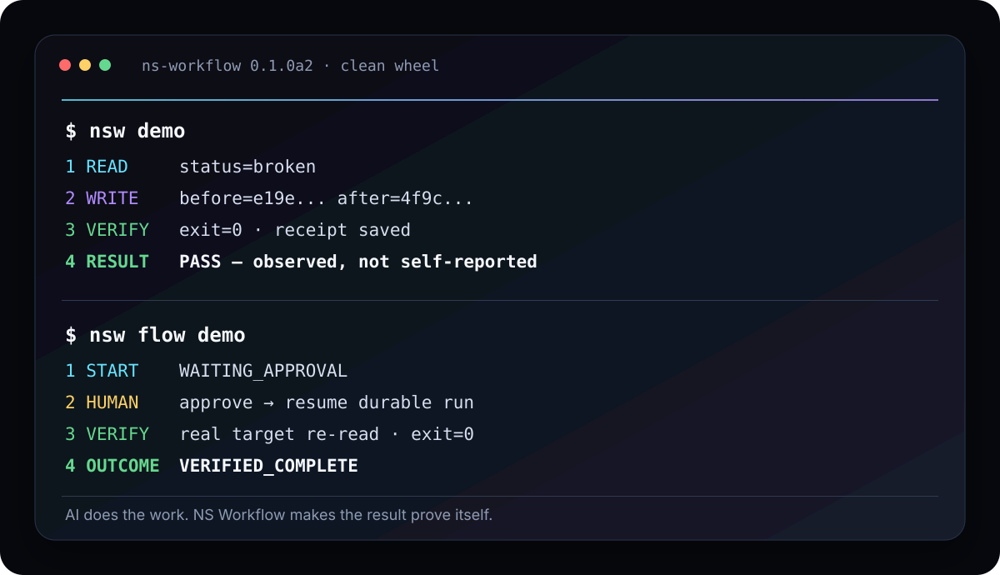

# NS Workflow

**Give AI real work. Make it prove the result.**

[](https://github.com/nslabhwan/ns-workflow/actions/workflows/ci.yml)
[](https://www.python.org/)
[](LICENSE)

Connect an MCP-capable AI to a real project folder without handing it an unrestricted shell.
NS Workflow gives the agent five bounded tools and one rule that matters:

> **A task is not complete because the agent says so. It is complete when the requested result is observed.**

`STATUS → READ → WRITE → RUN → VERIFY`



## 30-second proof

No model account is required for the first demo.

```bash
python -m pip install "git+https://github.com/nslabhwan/ns-workflow.git"
nsw demo
```

Expected shape:

```text
NS Workflow zero-config proof
1 READ    ... content=status=broken
2 WRITE   before=... after=...
3 VERIFY  exit=0 receipt=.nsworkflow/receipts/...
4 RESULT  PASS — requested state was observed, not self-reported
```

Want the durable workflow proof too?

```bash
nsw flow demo
```

It pauses at `WAITING_APPROVAL`, resumes after approval, changes the real target, verifies the result, persists the run, and only then ends as:

```text
VERIFIED_COMPLETE
```

If that is the behavior you expected from AI agents in the first place, this project is for you.

## Connect your AI

Inside the project the AI should work on:

```bash
nsw init .
nsw doctor
nsw connect --client generic --workspace .
```

For a Claude-style MCP config:

```bash
nsw connect --client claude --workspace .
```

The underlying local MCP server is simply:

```bash
nsw mcp --workspace /absolute/path/to/your-project
```

Any client that supports a local stdio MCP server can use the same capability surface. Client-specific setup is documented only after we verify it instead of pretending every client behaves the same way.

## Five tools, not fifty

| Tool | What it does |
| --- | --- |
| `ns_status` | Shows the workspace boundary and command allowlist |
| `ns_read` | Reads one bounded text file |
| `ns_write` | Performs an atomic write with optional SHA-256 compare-and-swap |
| `ns_run` | Runs one allowlisted argv command with timeout/output bounds |
| `ns_verify` | Runs an explicit verification command and records the observed result |

Every operation leaves a local receipt under `.nsworkflow/receipts/`.

That small surface is deliberate. Capability growth should happen behind stable, auditable contracts instead of an endless pile of public tools.

## Durable workflows when one command is not enough

NS Workflow also includes a small project-local workflow engine for work that must survive a pause, human decision, or process restart.

Create a starter flow:

```bash
nsw flow template verified-change.json
```

Start it:

```bash
nsw flow start verified-change.json --workspace .
```

Inspect a durable run:

```bash
nsw flow status <run_id> --workspace .
```

Resolve an approval and resume:

```bash
nsw flow decide verified-change.json <run_id> approve --workspace .
```

The current flow runtime supports:

- deterministic `call` steps
- `condition` branches
- human `approval` pauses
- explicit `verify` steps
- durable state and append-only event evidence
- bounded transition counts
- reject-without-mutation behavior
- `VERIFIED_COMPLETE` only when verification evidence exists

## Why this exists

AI coding and automation tools can already generate impressive plans and patches. The uncomfortable failures happen after that:

- the agent says **done**, but the file never changed
- a stale agent overwrites a newer edit
- a retry repeats an already-completed mutation
- a command was supposedly executed, but nobody can show the result
- an approval is lost when the process restarts
- historical state accidentally becomes current authority again

NS Workflow comes from repeatedly hitting those failure modes in a real long-running multi-agent system and then rebuilding only the portable behavior as a standalone open-source product.

The private system is **not** copied into this repository. The useful invariants are.

## What actually happens

```text
Your AI client
     │
     │ MCP / stdio
     ▼
┌─────────────────────────────────────┐
│             NS Workflow             │
│                                     │
│ STATUS   READ   WRITE   RUN   VERIFY│
│                                     │
│ durable flow → approval → resume    │
└──────────────────┬──────────────────┘
                   │
                   ▼
             your workspace
                   │
                   ├─ atomic changes
                   ├─ bounded commands
                   ├─ durable run state
                   ├─ verification evidence
                   └─ receipts
```

## Safety model

NS Workflow is a guardrail layer, not a hardened OS sandbox.

By default it reduces accidental authority through:

- workspace-root file boundaries
- absolute-path denial
- path traversal denial
- symlink escape denial
- common secret-like path denial
- atomic writes
- optional SHA-256 compare-and-swap protection
- argv-only process execution
- explicit command allowlisting
- no shell executable in the default allowlist
- bounded timeout and output size
- minimal child-process environment instead of inheriting arbitrary secrets
- local receipts for observable execution evidence

For hostile-code containment, run NS Workflow inside a container, VM, disposable cloud host, or another OS-level sandbox.

## Direct CLI use

You do not need an AI client to use the execution boundary.

```bash
nsw status --workspace .
nsw read README.md --workspace .
nsw write notes.txt --workspace . --content "hello"
nsw run --workspace . -- git status --short
nsw verify --workspace . -- python3 -m pytest -q
```

## Configuration

`nsw init` creates `.nsworkflow/config.json` with a deliberately small default command set and bounded read/output/time limits.

You can opt into additional commands. NS Workflow will not silently broaden its own authority.

## Current proof

`0.1.0a2` has been exercised on a fresh disposable Ubuntu 24.04 host, not only inside the development tree.

Current evidence:

- package regression: **17/17 PASS**
- real MCP `ClientSession` tool discovery: **5/5 tools exposed**
- MCP `READ → WRITE → VERIFY`: **PASS**
- wheel build: **PASS**
- fresh venv wheel install: **PASS**
- installed zero-config read/write/verify demo: **PASS**
- installed durable flow: `WAITING_APPROVAL → approve → COMPLETED / VERIFIED_COMPLETE`: **PASS**

Broad external-user onboarding, every AI client, Windows/macOS field testing and market adoption are still validation work. Those boundaries are intentional and public.

## What this is not

NS Workflow is not:

- another hosted AI subscription
- a model provider
- an unrestricted remote shell
- a replacement for containers or VMs
- a giant connector marketplace
- a claim that every MCP client has identical configuration
- a copy of the private NS runtime

It is a small, inspectable execution + workflow layer with proof of result.

## Roadmap

Ordered by user value:

- one-command setup for verified major MCP clients
- richer diff and verification receipts
- disposable execution mode
- resumable handoff between AI sessions
- optional local dashboard
- signed receipts
- stack-specific workflow packs
- Windows and macOS onboarding polish

## Contributing

Issues and small focused PRs are welcome. Reliability changes should include a regression that proves the failure class they prevent.

See [CONTRIBUTING.md](CONTRIBUTING.md).

## License

MIT. Use it, fork it, embed it, improve it.

---

**If NS Workflow saves you from one false “done”, ⭐ the repo so the project is easier for the next person to find.**
